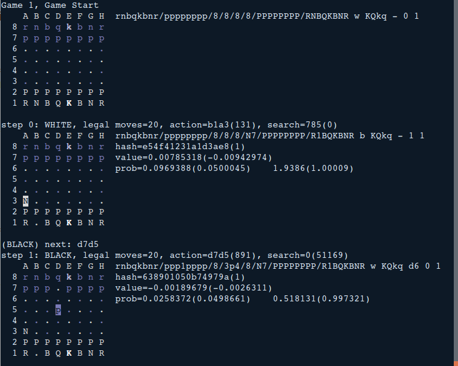

# chess_zero
After finishing go_zero project, I thought to try the chess too just because my son was learning chess and I thought if I can train a program to compete with him. 
I did not expect it would be an advanced player as I know the computer power is there. But just to try how far I can go. 
The program is based on previous go_zero but I changed the algorithm as per AlphaZero paper. And wrote a chess board in c++.
AlphaZero paper can be found at https://arxiv.org/pdf/1712.01815.pdf

## What's included
* A chess player program written in c++11. 
* A trainer written in python 3. 

## What's required
* Library magic-bit to generate magic bit files .magic. .magic files need to be placed in the bin directory to be used at runtime. Thanks to https://github.com/goutham/magic-bits
* Compile tensorflow from source code. Following the link to install tensorflow https://www.tensorflow.org/install/install_sources
* tensorflow r1.14. Later version has not been tested. One addtional step after compile tensorflow as per the instruction is to compile the //tensorflow:libtensorflow.so which will be used in the c++ player. 
* The tensorflow include and lib paths in the makefile need to be updated accordingly.

## How to run it
* self play
```shell
./chess_r -n 100 -s -l
```
  The player will automatically use the latest model to do self play 100 games. All the moves are saved with -l option. 
  
* evaluation
```shell
./chess_r -m1 [model number1] -m2 [model number2] -n 100 -s
```
  this is to evaluate two models by playing 100 games and showing the winners and some other stats. 
  
* play with human
```shell
./chess_r -m1 [model number] -m2 eric
./chess_r -m1 [model number] -m2 eric -f "[a FEN string]" 
```
  this will play 1 game with human or starting from a board position if a FEN string is given. 


 
## other features
* check perft number and evaluate the chess engine speed. https://www.chessprogramming.org/Perft_Results has more details on what this perft number means.
```shell 
./chess_r -p [depth] 
```

* test some perft numbers of some specicial board position
	- n1n5/PPPk4/8/8/8/8/4Kppp/5N1N b - - 0 1
	- r3k2r/p1ppqpb1/bn2pnp1/3PN3/1p2P3/2N2Q1p/PPPBBPPP/R3K2R w KQkq - 0 1
	- rnbqkbnr/pppppppp/8/8/8/8/PPPPPPPP/RNBQKBNR w KQkq - 0 1


```shell 
./chess_r -t 
```

## training


